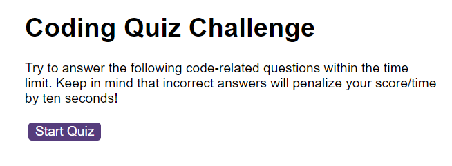
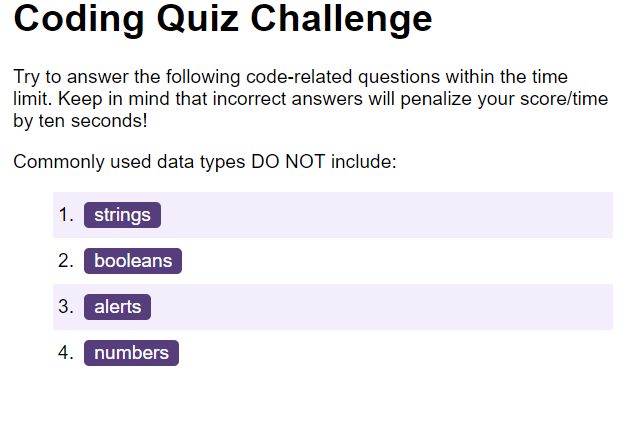
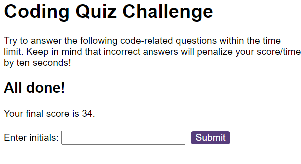
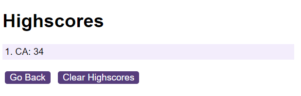

## Notes

A simple application that takes the user through a timed quiz.  

The quiz questions are provided in questions.js.  A better way to do this might be through the use of a back-end data source allowing for administrative changes to the questions and answers.

The quiz stores its answers in browser storage which could also benefit from a back-end database to allow scores to be persisted across browsers.

The code, as write, makes extensive use of global variables, which would seem inefficient.  A refactoring to make use of objects and passing these round might make the code more maintainable.


## User Story

```
AS A coding boot camp student
I WANT to take a timed quiz on JavaScript fundamentals that stores high scores
SO THAT I can gauge my progress compared to my peers
```

## Acceptance Criteria

```
GIVEN I am taking a code quiz
WHEN I click the start button
THEN a timer starts and I am presented with a question
WHEN I answer a question
THEN I am presented with another question
WHEN I answer a question incorrectly
THEN time is subtracted from the clock
WHEN all questions are answered or the timer reaches 0
THEN the game is over
WHEN the game is over
THEN I can save my initials and my score
```
### Screenshots







